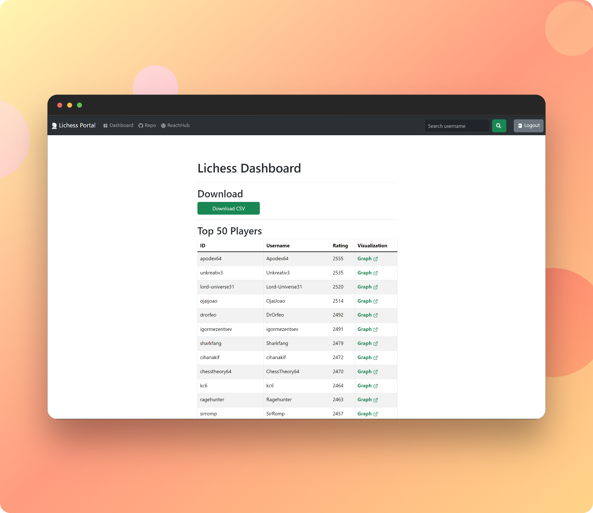
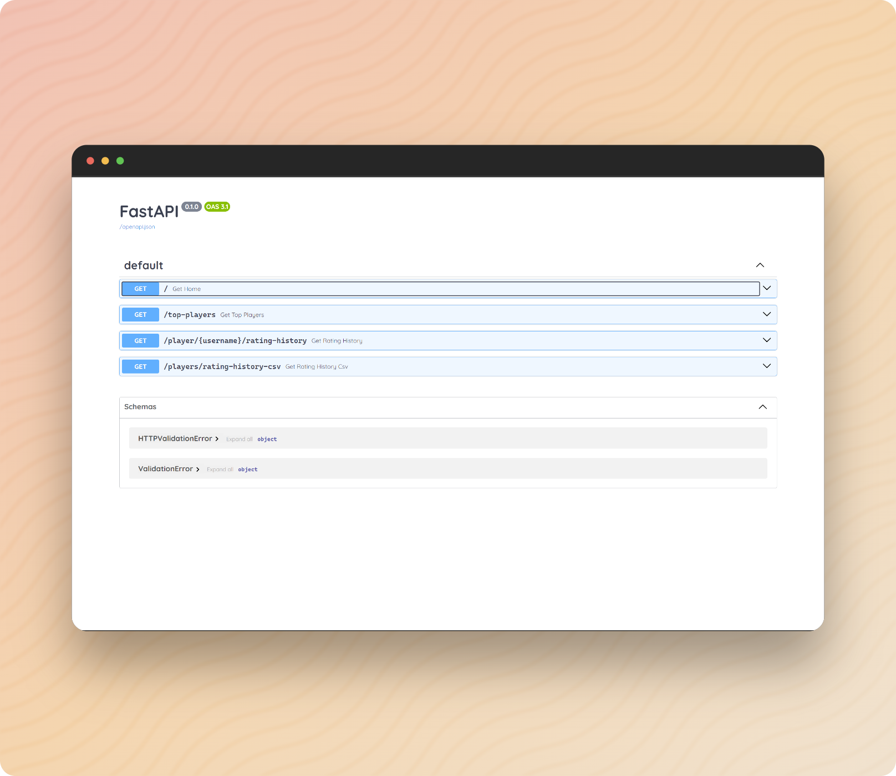
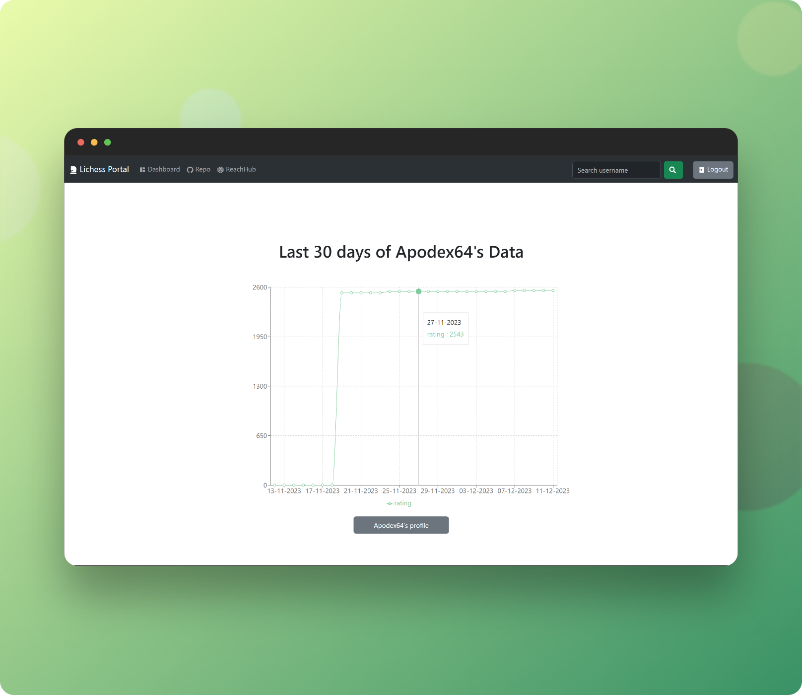

# Lichess Dashboard 
## Reach-Hub's Project | Pranjal Kumar
Project files for reach-hub custom ***Lichess API***, featuring Frontend client with **ReactJs** and Backend server with **Python**, **FastAPI** & **PostgreSQL**. 

<div align="center">

</div>
<h3 align="center">
    🔹
    <a href="https://github.com/pranjal-barnwal/reach-hub/issues">Report Bug</a> &nbsp;
    🔹 &nbsp;
    <a href="https://github.com/pranjal-barnwal/reach-hub/issues">Request Feature</a>
    🔹
</h3>


## Index
- [**Built with**](#built-with)
- [**Functionality**](#functionality)
- [**API Endpoints**](#endpoints-of-api)
- [**Documentation**](#documentation-📃)
    - [**Backend docs**](https://github.com/pranjal-barnwal/reach-hub/blob/main/backend/README.md)
    - [**Frontend docs**](https://github.com/pranjal-barnwal/reach-hub/blob/main/frontend/README.md)
    - [**Official Lichess API**](https://lichess.org/api)
- [**Requirements**](#requirements)
- [**Set up**](#set-up)
- [**Optimization**](#optimizations)
- [**Future Propositions**](#future-poropositions)
- [**License**](#license)
- [**Support**](#show-your-support)




## Built with
- **Frontend:** ReactJs, axios, react-hooks, recharts, react-bootstrap, react-icons, auth0
- **Backend:** Python, FastAPI, PostgreSQL, psycopg2
- **Tools:** Thunderclient, Nodemon


## Functionality
- Access and view the rating history for an individual player
- Obtain list of top-performing players.
- Download a CSV document comprising the complete rating history for all players.

## Endpoints of API
| Endpoint                            | Method | Description                                      | Example                                      |
| ----------------------------------- | ------ | ------------------------------------------------ | -------------------------------------------- |
| `/`  | GET    | Testing connection                     | `curl {baseURL}/` |
| `/player/{username}/rating-history`  | GET    | Username's rating history                     | `curl {baseURL}/player/{username}/rating-history` |
| `/top-players`                      | GET    | Returns list of top players                          | `curl {baseURL}/top-players`     |
| `/players/rating-history-csv`        | GET    | Download top players' rating history in CSV         | `curl {baseURL}/players/rating-history-csv` |

- **{baseurl}** for running API service locally will be: [`localhost:8000`](http://localhost:8000) by default



## Documentation 📃
- [**Backend Doc**](https://github.com/pranjal-barnwal/reach-hub/blob/main/backend/README.md): Complete backend client guide
- [**Frontend Doc**](https://github.com/pranjal-barnwal/reach-hub/blob/main/frontend/README.md): Complete frontend client guide
- [**Lichess API**](https://lichess.org/api): Official Lichess API documentation

> Read it before moving forward

## Requirements
- Git
- PostgreSQL
- Python
- NodeJs
- NPM

## Set up
### Clone the Repository
```bash
git clone git@github.com:pranjal-barnwal/reach-hub.git
cd reach-hub
```

### Database set up
1. Install [**PostgreSQL**](https://www.postgresql.org/download/) with default configurations
1. Set `username` and `password`, remember this because we will need it in `./backend/app.py` file to connect with database
1. Open **pgAdmin** client
1. Create Database with name: `csvstore`
1. Inside `csvstore`, create Table with name: `csvtable`
1. Inside `csvtable`, create Column: `csv_content`. 
1. With this our schema is ready
1. Now come back to: `./backend/app.py` file and update all the necessary changes, updating the credentials into it
    ```py
    conn = psycopg2.connect(
        dbname='csvstore',
        user='postgres',
        password='1234',
        host='localhost',
        port="5432"
    )
    ```
1. Now we're ready to move forward 


### Server set up
```bash
# moving to the backend folder
cd .\backend\ 

# installing all the dependencies
pip install fastapi requests io csv datetime psycopg2 schedule

# activating virtual environment script
.\env\Scripts\activate

# running app of main.py for server
uvicorn main:app --reload
```
**API-url:** [`localhost:8000`](http://localhost:8000)
> Apply endpoints at the end of this url


### Frontend set up
```bash
# moving to frontend folder
cd .\frontend\ 

# installing all required dependencies
npm i

# running frontend client
npm start
```
**Client-url:** [`localhost:3000`](http://localhost:3000)


## Optimizations
- ~~Once the top players are loaded in Frontend client, we will check if the rating history CSV has been loaded. If it hasn't, we will start the process in the background. This will allow the CSV to be downloaded faster when the user clicks the "Download CSV" button.~~
    - *There's a limit of 1 second in Lichess API for each request. So 50 requests will by-default will take about 50 seconds to process with additional delays* 
    - This was the initial implementation which we implemented, but later replaced with the below method of directly fetching data from PostgreSQL database

- **Backend Optimization using Database:** More improved model was to first create the complete CSV table in advance and storing it into the PostgreSQL Database and fetching it directly from our database, instead of using Lichess API again and again.

    - *We would still need to update the database because of updated ratings. So we used a self repeatable function with 15-minute interval to update the database*
    - To do this, we used `schedule` module in Python to call `get_rating_history_csv()` after every 15 minutes

- **Frontend Optimization:** Improved load time and removed unnecessary reloads of Top-Players data by loading it directly in `App.js` & updating content with `useState` Hook and then passing it into `Dashboard.jsx` using prop drilling

- Since loading `/player/{username}/rating-history` endpoint is not much resource and time intensive, so we don't need to store them in Database currently. We will keep it for the next version upgrade. 
    - *We could also have used a different table with Primary-Key as username and other elements in row would be storing the ratings of last 30 days. So that if the same query occurs for the username, we could have fetched based upon the Primary-Key (username)*




## Future Poropositions
- **Frontend**
    - using ***Redux*** for Global State Management
    - improving designs and adding more metrics and charts in `RatingHistory.jsx` for user
    - replacing **Bootstrap** with ***Chakra UI***
- **Backend**
    - storing rating-history of top 50 users and the last users searched onto PostgreSQL database, as an effective method of ***Caching*** 
    - adding more features for Signed Users

## License
[**MIT License**](https://github.com/pranjal-barnwal/reach-hub/blob/main/license)


## Show your support
Hit the ⭐ if you liked this Project!

**Contact** `pranjal.barn@gmail.com` for support


